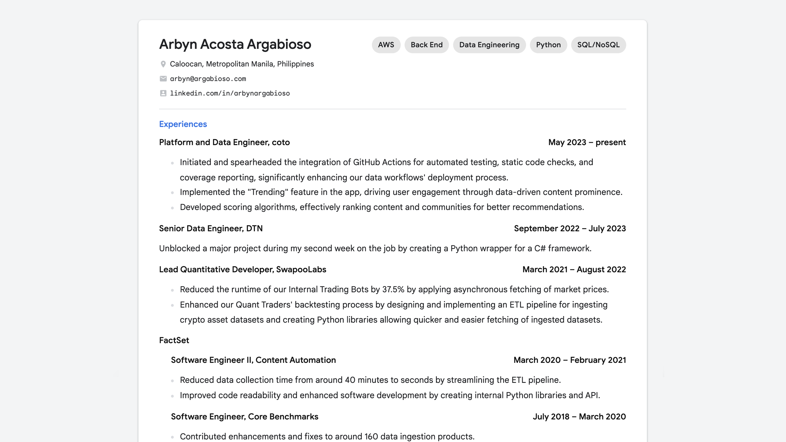

## Online Resume
> The resume structure is inspired by [David Malan's CV](https://cs.harvard.edu/malan/cv/).

 

Instead of directly embeding a PDF into a webpage, I decided to create the actual resume using HTML and CSS to allow better screen resposiveness. You can visit the live webpage on <a href="https://arbyn.argabioso.com/resume" target="_blank">https://arbyn.argabioso.com/resume</a>.

## Online Portfolio

 

A quick portfolio I made when I was applying as freelancer back in 2017. You can visit the live webpage on <a href="https://arbyn.argabioso.com/portfolio" target="_blank">https://arbyn.argabioso.com/portfolio</a>.

## Online Family Tree

 

Due to some of my relatives and friends passing away these past few years, I've decided to remember them by creating this family tree web page that dynamically changes based on the available data provided. You can visit the live webpage on <a href="https://arbyn.argabioso.com/family?q=arbyn" target="_blank">https://arbyn.argabioso.com/family</a>.

1. testing
 

<b>On the importance of sentence length</b>

This sentence has five words. Here are five more words. Five-word sentences are fine. But several together bocome monotonous. Listen to what is happening. The writing is getting boring. The sound of it drones. It's like a stuck record. The ear demands some variety.  
    Now listen. I vary the sentence length, and I create music. Music. The writing sings. It has a pleasent rhythm, a lilt, a harmony. I use short sentences. And I use sentences of medium length. And sometimes when I am certain the reader is rested, I will engage him with a sentence of considerable length, a sentence that burns with energy and builds with all the impetus of a crescendo, the roll of the drums, the crash of the cymbals -- sounds that say listen to this, it is important.

 <b>- Gary Provost</b> <i>(100 Ways to Improve Your Writing, 1985)</i>

